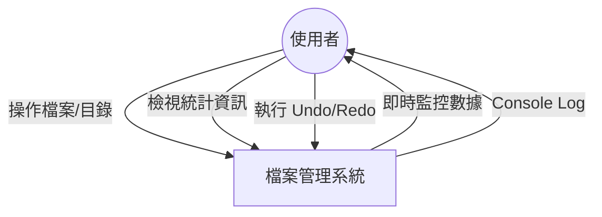
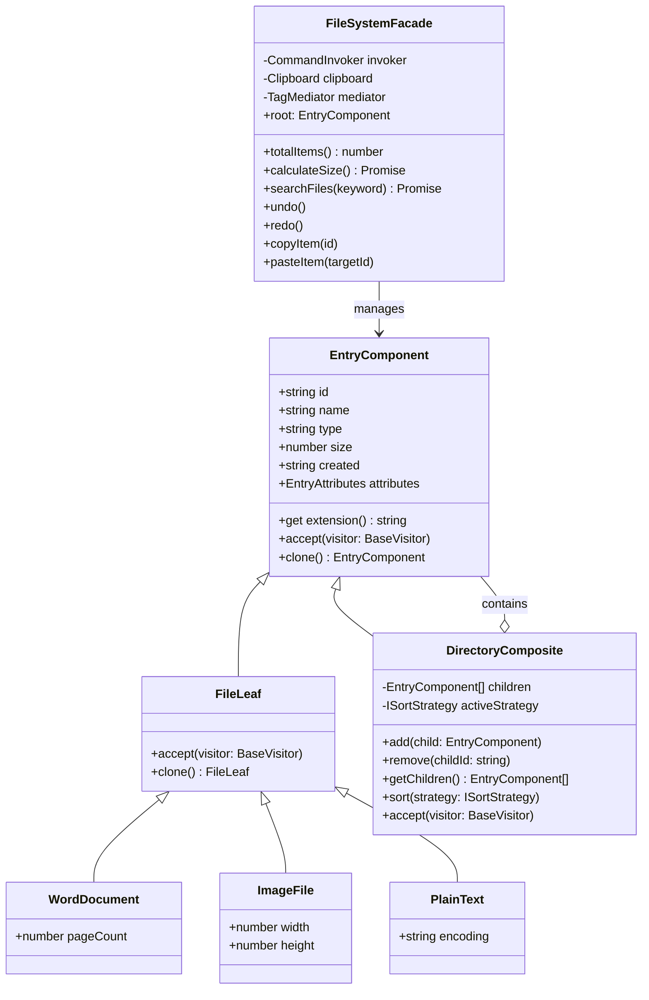
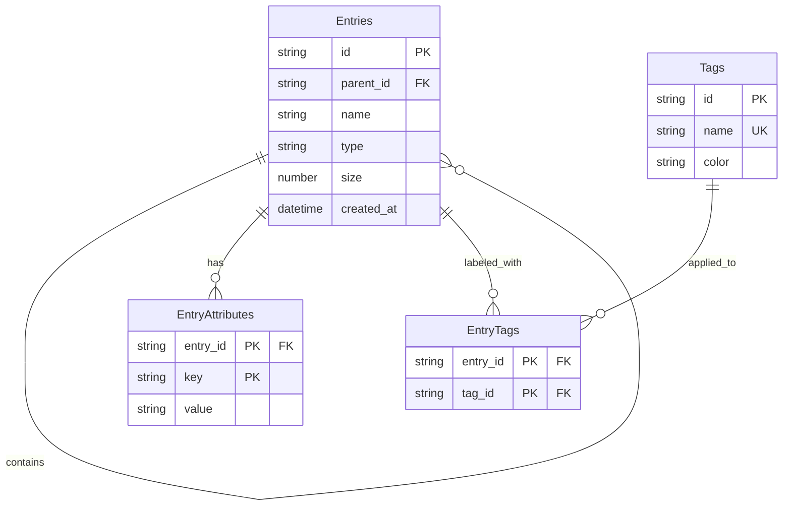
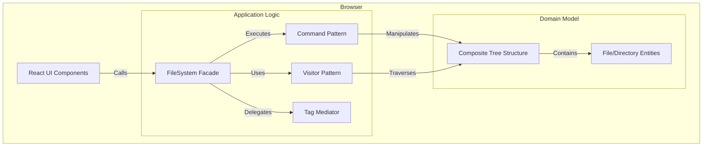
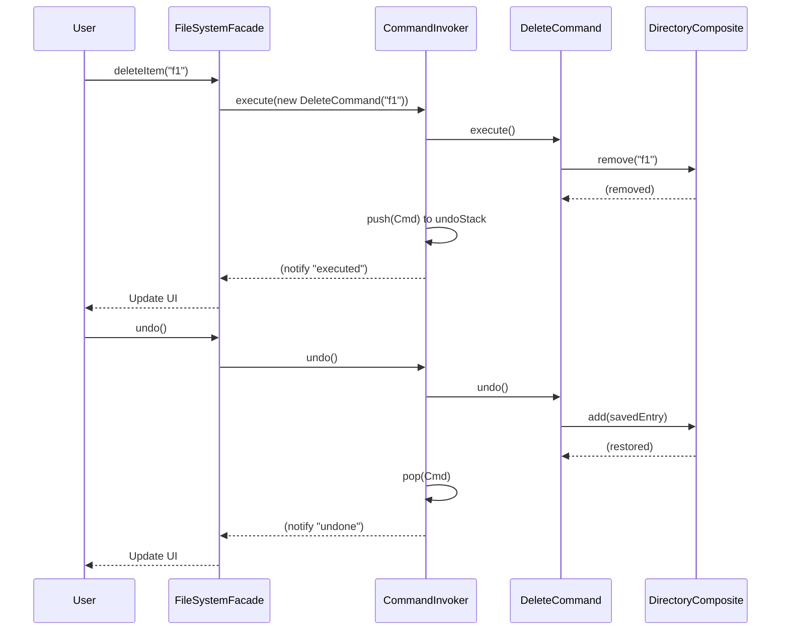
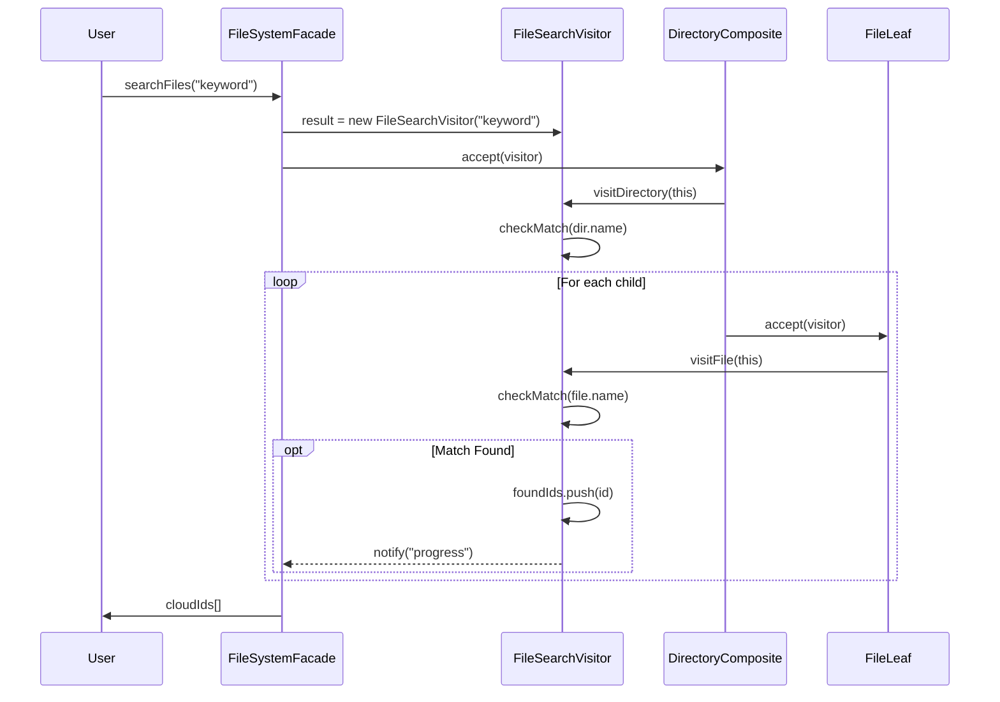
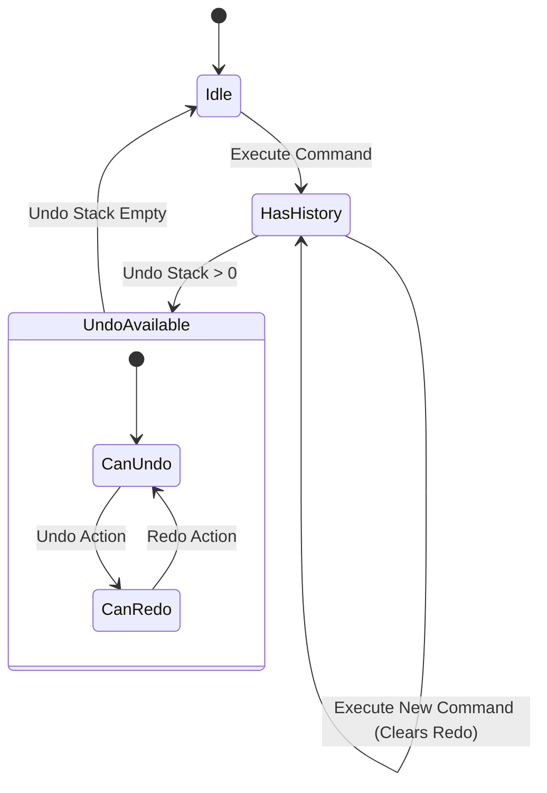

# 檔案管理系統設計模式規格書 (File Management System Design Spec)

## 1. 系統簡介與脈絡 (System Context)

### 1.1 系統目標
本系統為一個基於 React 的檔案管理教學應用程式，主要目標是展示如何運用多種設計模式（Design Patterns）來解決複雜的軟體架構問題。系統模擬了真實檔案總管的核心行為，包括檔案/目錄的 CRUD、搜尋、排序、標籤管理、以及操作的復原與重做 (Undo/Redo)。

### 1.2 系統邊界 (System Context Diagram)

## 2. 關於領域模型 (Domain Model)

### 2.1 類別圖 (Class Diagram)

本系統核心採用 **Composite Pattern** 來建構檔案系統的樹狀結構，並結合 **Command Pattern** 封裝操作，**Visitor Pattern** 處理遍歷邏輯。

## 3. 資料庫設計 (Database Design)

雖然本系統為純前端應用，但為了符合完整架構設計模擬，以下定義等效的實體關聯模型 (ER Model)。

### 3.1 ER 圖 (Entity-Relationship Diagram)

### 3.2 資料字典 (Data Dictionary)

| Table Name | Column | Type | PK/FK | Description |
| :--- | :--- | :--- | :--- | :--- |
| **Entries** | id | STRING | PK | 檔案或目錄的唯一識別碼 |
| | parent_id | STRING | FK | 父目錄 ID (Root 為 null) |
| | name | STRING | | 檔案名稱 |
| | type | STRING | | 類型 (Directory, Word, Image, Text) |
| | size | NUMBER | | 檔案大小 (KB) |
| | created_at | DATETIME | | 建立時間 |
| **EntryAttributes** | entry_id | STRING | PK, FK | 對應的 Entry ID (複合主鍵之一) |
| | key | STRING | PK | 屬性名稱 (複合主鍵之二) |
| | value | STRING | | 屬性值 |
| **Tags** | id | STRING | PK | 標籤 ID |
| | name | STRING | UK | 標籤名稱 (如 Urgent) |
| | color | STRING | | 顯示顏色 |
| **EntryTags** | entry_id | STRING | PK, FK | Entry ID (複合主鍵之一) |
| | tag_id | STRING | PK, FK | Tag ID (複合主鍵之二) |

## 4. 系統架構與設計 (Architecture & Design)

### 4.1 架構分層 (Clean Architecture)

遵循 Clean Architecture 原則，將系統分為四層：

1.  **Frameworks & Drivers (External)**:
    *   React Components (`ExplorerTab`, `App`)
    *   Browser DOM / Console
    *   Storage (Memory)
2.  **Interface Adapters**:
    *   `DashboardAdapter`: 將內部統計資料轉換為 UI 可用的格式。
    *   `FileSystemFacade`: 提供簡易介面供 View 層呼叫。
3.  **Application Business Rules (Use Cases)**:
    *   `CommandInvoker`: 管理 Undo/Redo 流程。
    *   Specific Commands (`CopyCommand`, `DeleteCommand`, `SortCommand`).
    *   Visitors (`StatisticsVisitor`, `FileSearchVisitor`).
4.  **Enterprise Business Rules (Entities)**:
    *   `EntryComponent`, `FileLeaf`, `DirectoryComposite`: 核心領域物件。
    *   `Clipboard` (Singleton).

### 4.2 C4 Model - Container Diagram

## 5. 關鍵流程序列圖 (Sequence Diagrams)

### 5.1 執行檔案刪除與復原 (Delete & Undo)

描述使用者點擊刪除按鈕，直到 Undo 恢復檔案的流程。

### 5.2 檔案搜尋 (Search Files)

描述透過 Visitor 模式遍歷樹狀結構進行搜尋的流程。

## 6. 狀態圖 (State Diagram)

描述 `CommandInvoker` 中 Undo/Redo Stack 的狀態變化概念。

## 7. 程式規範與目錄結構

### 7.1 目錄結構
依據 Clean Architecture 分層原則：

- `src/components/`: **Interface Adapter / View**. UI 元件。
- `src/patterns/`: **Entities / Use Cases**. 核心商業邏輯與設計模式實作。
- `src/data/`: **Data Source**. 模擬資料來源。
- `src/assets/`: **Assets**. 靜態資源。

### 7.2 程式碼撰寫規範
- **類別與變數命名**: 採用駝峰式命名 (camelCase/PascalCase)，類別名稱需明確表達其模式角色 (如 `DirectoryComposite`, `DeleteCommand`)。
- **註解**: 所有公開介面 (Interface) 與類別 (Class) 必須包含 JSDoc 格式的中文註解。
- **原則**: 嚴格遵守 SOLID 原則，特別是單一職責原則 (SRP) 與依賴反轉原則 (DIP)。
